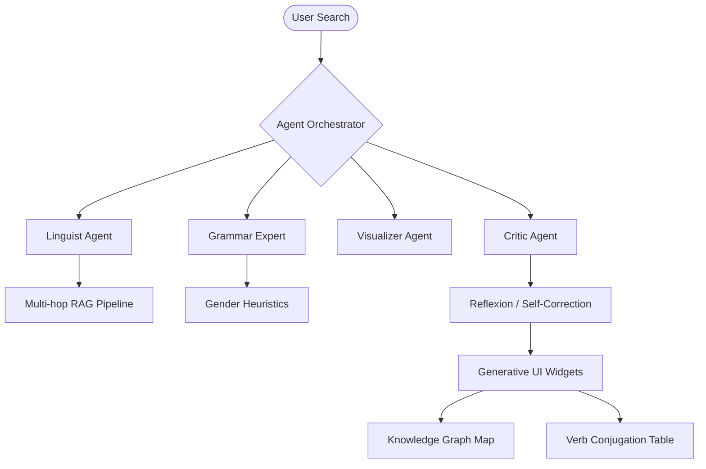

# 🇩🇪 DeutschDict — Agentic AI Learning Platform

> A production-grade German learning ecosystem powered by an advanced **Agentic Cognitive Architecture**.

DeutschDict is not just a dictionary; it is a **proactive tutor** that synthesizes multi-source linguistic data, visualizes semantic knowledge graphs, and optimizes long-term memory retention through algorithmic spaced repetition.

---

## 🧠 Cognitive Architecture

DeutschDict implements a **Stateful Multi-Agent Orchestrator** to handle linguistic queries. Every search triggers a reasoning loop across specialized agents:

---

## ✨ Advanced Features

### 🧪 SM-2 Spaced Repetition (SRS)
The quiz system is powered by the **SM-2 Algorithm**. Instead of random flashcards, DeutschDict calculates the "Ease Factor" and "Optimal Interval" for every word based on your performance, ensuring you review words exactly when you're about to forget them.

### 🎨 Generative UI Widgets
Inspired by the **Vercel AI SDK**, DeutschDict renders dynamic, interactive widgets based on the agent's tool calls:
- **Interactive Verb Tables**: On-the-fly conjugation for any German verb.
- **Semantic Knowledge Maps**: A visual graph interface to traverse related words via graph-based retrieval.

### 🛡️ Corrective RAG (Multi-hop)
Avoids "Hallucinations" by chaining multiple retrieval steps:
1. **Hop 1**: Primary linguistic API (FreeDictionary).
2. **Hop 2**: Fallback to Wiktionary REST API if quality is low.
3. **Quality Scoring**: Every definition is assigned a RAG Quality Badge (High/Medium/Low).

### 🧐 Metacognitive Insights
A proactive agent monitors your learning session and provides **Agent Insights**—real-time advice based on your search history, accuracy trends, and SRS due dates.

---

## 🔬 Research Bibliography

DeutschDict is a practical implementation of several industry-standard AI research papers and frameworks:

- **ReAct** (Reason + Act): Multi-step reasoning traces in search.
- **Reflexion**: Mistake-driven learning and reflection notes.
- **Toolformer**: Heuristic gender and part-of-speech detection.
- **GraphRAG**: Semantic clustering and knowledge graph navigation.
- **Generative Agents**: Persistent episodic memory and session logs.
- **SM-2 Algorithm**: Algorithmic memory consolidation.

---

## 🛠️ Tech Stack (2026 Edition)

- **Engine**: Vanilla JavaScript with Stateful Agentic Logic.
- **Design**: Premium Glassmorphism / Bento Dashboarding.
- **Storage**: Persistent LocalStorage with Fault-Tolerant JSON.
- **APIs**: Multi-hop RAG (FreeDict/Wiktionary), Unsplash (Visualizer).
- **Architecture**: Graph-based state machine.

---

## 🚀 Getting Started

1. **Live App**: Visit [DeutschDict Live](https://munissulaymon.github.io/DeutschDict).
2. **Local Development**: Clone the repo and open `index.html`. No build steps or server required—the entire agentic brain runs in your browser.

---

## 📜 License
MIT License. Built for the advancement of Agentic AI Learning.
